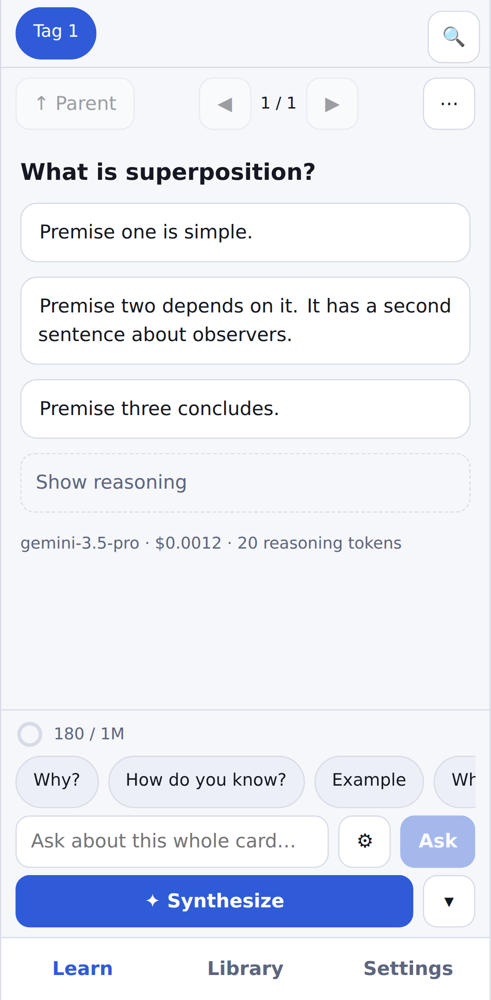
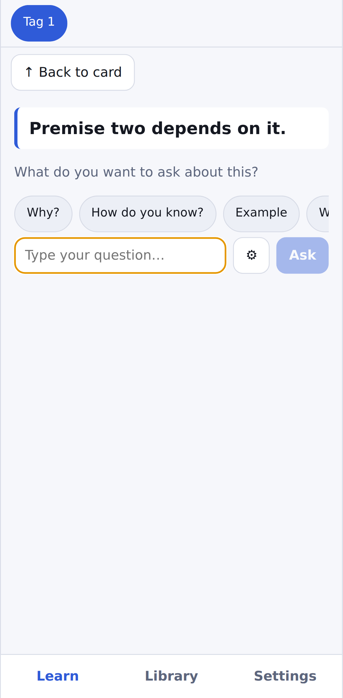

# Fractal

A mobile-only learning app: ask a frontier AI a question, then question every answer. Read [IDEA.md](IDEA.md) for the design.

 

## Run it

```bash
npm install
npm run dev        # http://localhost:5173 — open it in a phone-sized window
npm run build      # typecheck + production build into dist/
npm test           # unit tests (vitest)
npm run e2e        # Playwright on an emulated Pixel 7, OpenRouter mocked
```

Open the app, go to **Settings › Account** and tap **Connect OpenRouter** (or paste an API key). The key stays in your browser; set a spending limit on it at openrouter.ai.

## Put it on your phone

`.github/workflows/pages.yml` builds and deploys to GitHub Pages on every push to `main` (or run it by hand from the Actions tab). In the repository settings, set **Pages › Source** to **GitHub Actions**. Then open `https://<user>.github.io/<repo>/` on your phone and use **Add to Home screen**. That address is also the OpenRouter sign-in callback.

## Screenshots

`SCREENSHOTS=1 npx playwright test screenshots` regenerates `docs/screenshots/`.
